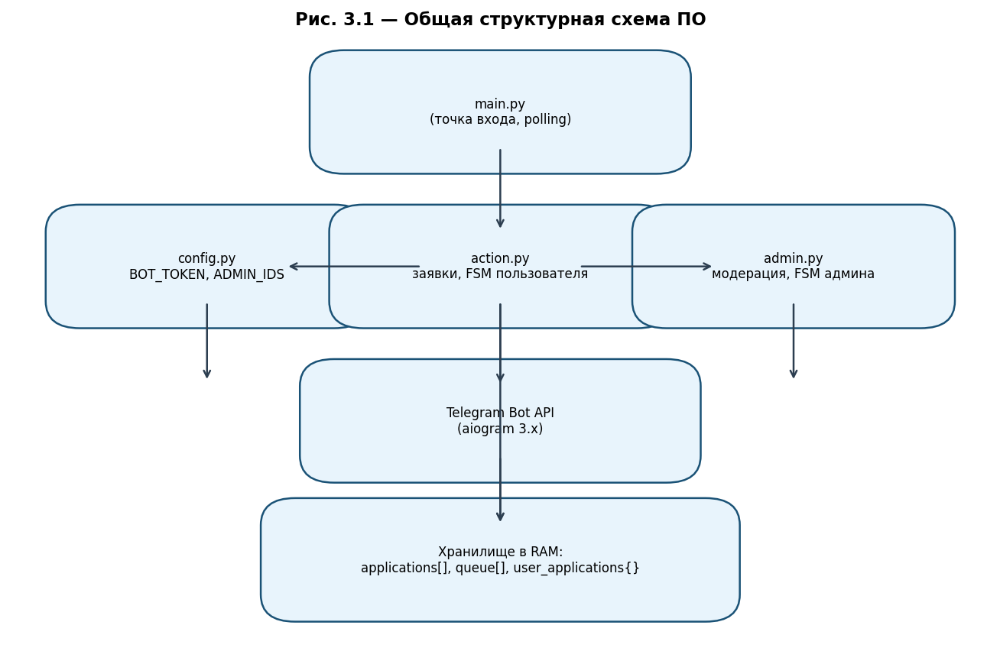
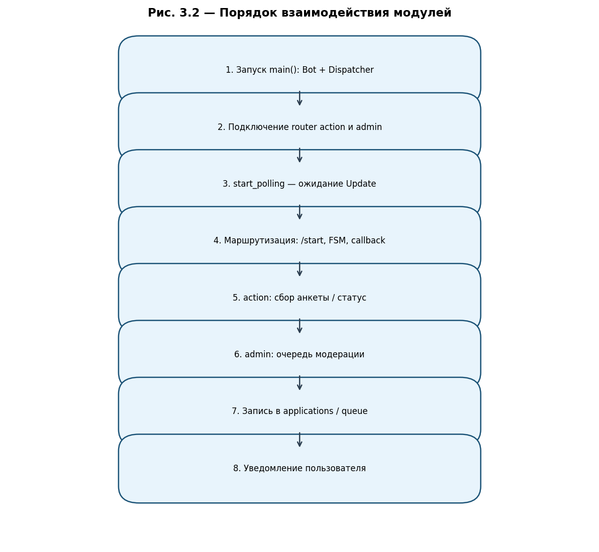
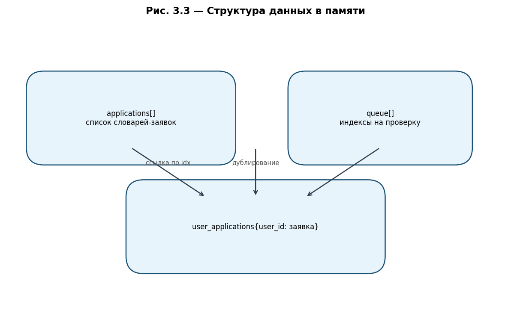
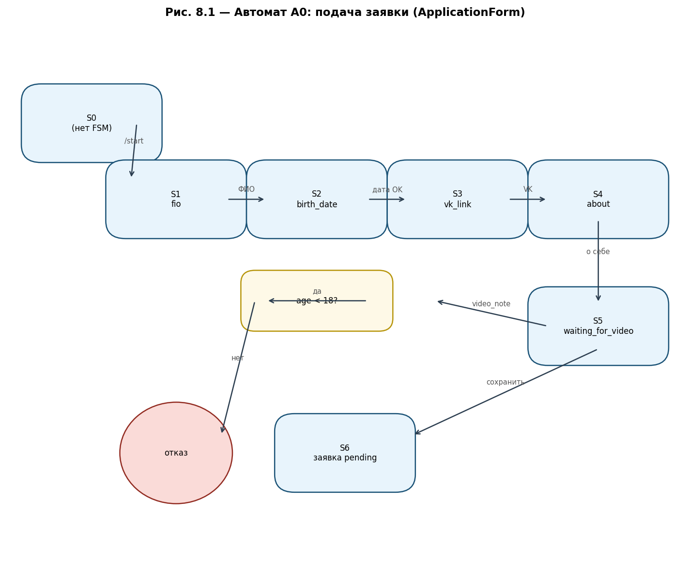
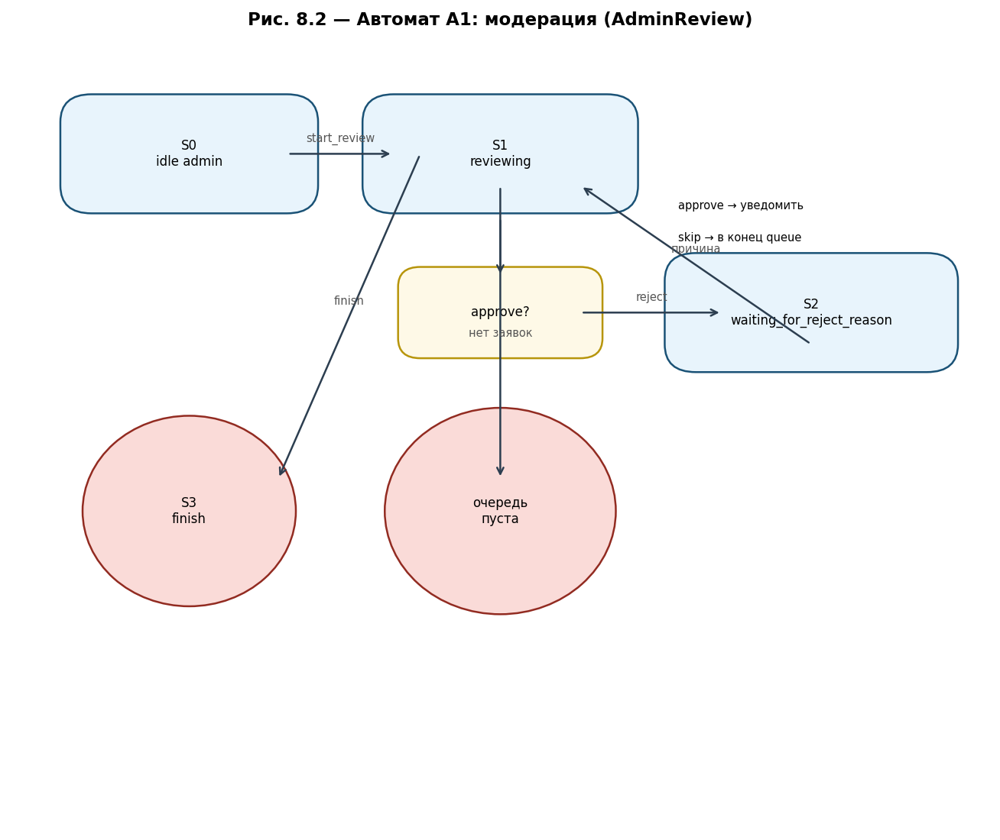
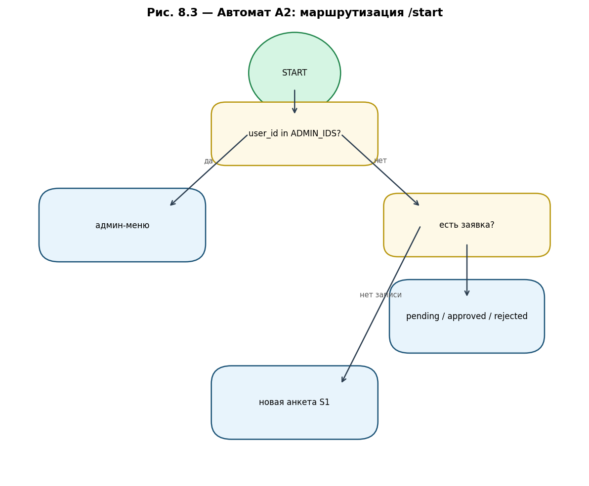

# TELEGRAM-БОТ ПРИЁМА ЗАЯВОК С ВЕРИФИКАЦИЕЙ ЖЕСТА (bot_ref_trom)

## ПРОГРАММНАЯ ДОКУМЕНТАЦИЯ

**Используемые технологии:** Python 3.10+, aiogram 3.x, FSM (Finite State Machine), HTML-разметка сообщений Telegram.

**Состав репозитория (исполняемая часть):**

| Файл | Назначение |
|------|------------|
| `main.py` | Точка входа, инициализация Bot/Dispatcher, polling |
| `config.py` | Токен бота и список ID администраторов |
| `action.py` | Логика пользователя: анкета, очередь, статус |
| `admin.py` | Логика администратора: просмотр и решение по заявкам |

**Иллюстрации (папка `doc/`):**

| Файл | Содержание |
|------|------------|
| `PROGRAMMNAYA_DOKUMENTACIYA.pdf` | Полная документация в формате PDF |
| `01_structural_scheme.png` | Рис. 3.1 — общая структурная схема |
| `02_interaction_flow.png` | Рис. 3.2 — порядок взаимодействия модулей |
| `03_automaton_A0_user_application.png` | Рис. 8.1 — автомат подачи заявки |
| `04_automaton_A1_admin_review.png` | Рис. 8.2 — автомат модерации |
| `05_automaton_A2_start_routing.png` | Рис. 8.3 — автомат маршрутизации /start |
| `06_data_storage.png` | Рис. 3.3 — структура данных в RAM |

---

## ОГЛАВЛЕНИЕ

1. [ВВЕДЕНИЕ](#1-введение)
2. [ЧАСТНОЕ ТЕХНИЧЕСКОЕ ЗАДАНИЕ](#2-частное-техническое-задание-на-подсистему-приёма-заявок)
3. [СТРУКТУРНАЯ СХЕМА ПРОГРАММНОГО ОБЕСПЕЧЕНИЯ](#3-структурная-схема-программного-обеспечения)
4. [ПЕРЕЧЕНЬ И НУМЕРАЦИЯ СОБЫТИЙ](#4-перечень-и-нумерация-событий)
5. [ПЕРЕЧЕНЬ И НУМЕРАЦИЯ ВХОДНЫХ ПЕРЕМЕННЫХ](#5-перечень-и-нумерация-входных-переменных)
6. [ПЕРЕЧЕНЬ И НУМЕРАЦИЯ ВЫХОДНЫХ ВОЗДЕЙСТВИЙ](#6-перечень-и-нумерация-выходных-воздействий)
7. [ПОЯСНЕНИЯ К ИСПОЛЬЗУЕМОЙ НОТАЦИИ](#7-пояснения-к-используемой-нотации)
8. [СИСТЕМОНЕЗАВИСИМАЯ ЧАСТЬ](#8-системонезависимая-часть)
9. [ИСХОДНЫЕ ТЕКСТЫ СИСТЕМОЗАВИСИМОЙ ЧАСТИ](#9-исходные-тексты-системозависимой-части)
10. [ПРОТОКОЛЫ ФУНКЦИОНИРОВАНИЯ](#10-протоколы-функционирования)
11. [ТРЕБОВАНИЯ К ПРОГРАММНОМУ ОБЕСПЕЧЕНИЮ](#11-требования-к-программному-обеспечению)
12. [ТРЕБОВАНИЯ К ПРОГРАММНОЙ ДОКУМЕНТАЦИИ](#12-требования-к-программной-документации)
13. [ТЕХНИКО-ЭКОНОМИЧЕСКИЕ ПОКАЗАТЕЛИ](#13-технико-экономические-показатели)
14. [СТАДИИ И ЭТАПЫ РАЗРАБОТКИ](#14-стадии-и-этапы-разработки)
15. [ПОРЯДОК КОНТРОЛЯ И ПРИЁМКИ](#15-порядок-контроля-и-приёмки)

---

## 1. ВВЕДЕНИЕ

Настоящий документ представляет собой проектную **программную документацию** на программное обеспечение **«Telegram-бот приёма заявок с верификацией жеста»** (рабочее имя репозитория: `bot_ref_trom`).

Система предназначена для **автоматизированного приёма заявок** от пользователей мессенджера Telegram с последующей **ручной модерацией** администратором. Пользователь заполняет анкету (ФИО, дата рождения, ссылка VK, текст «о себе»), подтверждает личность **видеосообщением (кружком)** с заранее назначенным случайным жестом-эмодзи. Администратор просматривает заявки из очереди, одобряет, отклоняет с указанием причины или откладывает проверку.

Документация разработана в соответствии с требованиями к курсовому/дипломному проектированию и демонстрирует применение **автоматного подхода (SWITCH-технологии)** для описания логики диалога с пользователем и администратором.

**Ограничения текущей реализации:**

- все заявки хранятся **только в оперативной памяти** процесса бота (при перезапуске данные теряются);
- автоматическое распознавание жеста на видео **не выполняется** — администратор визуально сверяет кружок с полем `expected_gesture`;
- проверка возраста выполняется по дате рождения (минимум 18 лет).

---

## 2. ЧАСТНОЕ ТЕХНИЧЕСКОЕ ЗАДАНИЕ НА ПОДСИСТЕМУ ПРИЁМА ЗАЯВОК

### 2.1. Назначение подсистемы

Подсистема приёма заявок является составной частью программного комплекса и обеспечивает:

- регистрацию пользователей через команду `/start`;
- пошаговый сбор анкеты в режиме FSM (конечный автомат состояний);
- валидацию формата даты рождения и ссылки VK;
- отсечение заявителей младше 18 лет;
- назначение случайного жеста из фиксированного набора эмодзи;
- приём **только** видеосообщений (`video_note`) на финальном шаге;
- постановку заявки в очередь `queue` со статусом `pending`;
- информирование пользователя о статусе через inline-кнопку «Проверить статус заявки»;
- модерацию заявок администратором: одобрение, отказ, пропуск, завершение сессии проверки.

### 2.2. Функциональные требования

#### 2.2.1. Роль «Пользователь»

1. **Старт диалога** — по `/start` начинается анкета, если нет блокирующего статуса (`pending`, `approved`).
2. **ФИО** — произвольная текстовая строка сохраняется в FSM.
3. **Дата рождения** — формат `ДД.ММ.ГГГГ`, проверка regex и `datetime.strptime`; при ошибке — повторный запрос без смены состояния.
4. **Возраст** — вычисление полных лет; при `age < 18` — очистка FSM, сообщение об отказе, анкета не создаётся.
5. **VK** — в тексте должна присутствовать подстрока `vk.com`.
6. **О себе** — произвольный текст.
7. **Жест** — случайный выбор из `["✌️", "👍", "🤙", "🤟"]`, сохранение в `expected_gesture`.
8. **Видео** — принимается только `Message` с `video_note`; иначе напоминание отправить кружок.
9. **После отправки** — создание записи заявки, добавление в `applications`, `user_applications`, `queue`; статус `pending`.

#### 2.2.2. Роль «Администратор»

1. Идентификация по списку `ADMIN_IDS` в `config.py`.
2. При `/start` — кнопка «Начать проверку заявок» вместо анкеты.
3. Команда `/start_review` или callback `admin_start_review` — показ первой заявки из `queue`.
4. Для каждой заявки: отправка `video_note`, текстовая сводка, кнопки ✅ / ❌ / ⏩ / 🛑.
5. **Одобрение** — статус `approved`, уведомление пользователю, удаление индекса из `queue`, переход к следующей.
6. **Отказ** — запрос причины (текст или `/skip`), статус `rejected`, опционально `reject_reason`, уведомление.
7. **Пропуск** — перенос индекса в конец `queue` без смены статуса.
8. **Завершить** — выход из режима reviewing, очистка FSM админа.

### 2.3. Требования к производительности

- Время отклика на команду пользователя — не более **2 с** при нормальной нагрузке Telegram API.
- Поддержка **не менее 100** одновременных открытых диалогов FSM (ограничение aiogram/памяти).
- Очередь модерации — операции O(n) при удалении из `queue` (список); для учебного проекта допустимо.

### 2.4. Требования к конфигурированию

- `BOT_TOKEN` — токен от [@BotFather](https://t.me/BotFather).
- `ADMIN_IDS` — список целочисленных Telegram user id администраторов.
- Секреты **не должны** попадать в систему контроля версий (см. `.gitignore`, рекомендуется вынос в `.env` при доработке).

### 2.5. Модель данных заявки

| Поле | Тип | Описание |
|------|-----|----------|
| `user_id` | `int` | Telegram ID заявителя |
| `fio` | `str` | ФИО |
| `birth_date` | `str` | Дата в формате ДД.ММ.ГГГГ |
| `vk_link` | `str` | URL страницы VK |
| `about` | `str` | Текст «о себе» |
| `expected_gesture` | `str` | Эмодзи жеста для видео |
| `video_file_id` | `str` | `file_id` кружка в Telegram |
| `status` | `str` | `pending` \| `approved` \| `rejected` |
| `reject_reason` | `str` \| отсутствует | Причина отказа (опционально) |

---

## 3. СТРУКТУРНАЯ СХЕМА ПРОГРАММНОГО ОБЕСПЕЧЕНИЯ

### 3.1. Общая структурная схема

Программа построена по **модульному принципу**:

- **main.py** — инициализация `Bot` с `ParseMode.HTML`, `Dispatcher`, подключение роутеров, `start_polling`.
- **config.py** — конфигурация без логики.
- **action.py** — роутер пользователя, FSM `ApplicationForm`, глобальные структуры данных, вспомогательные функции для admin.
- **admin.py** — роутер администратора, FSM `AdminReview`, UI модерации.



### 3.2. Порядок взаимодействия частей подсистемы

1. ОС запускает `python main.py` → `asyncio.run(main())`.
2. Создаётся `Bot(token=...)` и `Dispatcher()`.
3. `dp.include_router(action.router)` и `dp.include_router(admin.router)`.
4. `await dp.start_polling(bot)` — цикл получения `Update` от Telegram.
5. Фильтры aiogram направляют update в соответствующий handler (`CommandStart`, состояние FSM, `CallbackQuery`).
6. При завершении анкеты данные пишутся в `applications` / `queue` / `user_applications`.
7. Админские callback вызывают `update_application_status`, `remove_from_queue`, `move_to_end`, `get_next_pending_application`.
8. Бот отправляет исходящие сообщения через `message.answer` / `bot.send_message`.



### 3.3. Структура хранения в памяти



- **`applications`** — упорядоченный список всех заявок; индекс в списке используется в `queue`.
- **`queue`** — список индексов заявок со статусом, ожидающих проверки (FIFO с возможностью переноса в конец).
- **`user_applications`** — словарь `{user_id: заявка}` для быстрой проверки при `/start` и callback статуса.

---

## 4. ПЕРЕЧЕНЬ И НУМЕРАЦИЯ СОБЫТИЙ

События генерируются клиентом Telegram, диспетчером aiogram и обработчиками.

| Номер | Обозначение | Описание |
|-------|-------------|----------|
| E01 | `ev_start` | Получена команда `/start` |
| E02 | `ev_admin_start_review` | Callback `admin_start_review` или `/start_review` |
| E03 | `ev_text_fio` | Текст в состоянии `ApplicationForm.fio` |
| E04 | `ev_text_birth` | Текст в состоянии `birth_date` |
| E05 | `ev_birth_invalid` | Неверный формат/дата рождения |
| E06 | `ev_age_under_18` | Возраст меньше 18 |
| E07 | `ev_text_vk` | Текст в состоянии `vk_link` |
| E08 | `ev_vk_invalid` | В тексте нет `vk.com` |
| E09 | `ev_text_about` | Текст в состоянии `about` |
| E10 | `ev_video_note` | Видеосообщение в `waiting_for_video` |
| E11 | `ev_video_invalid` | Не video_note в `waiting_for_video` |
| E12 | `ev_check_status` | Callback `check_status` |
| E13 | `ev_approve` | Callback `approve` |
| E14 | `ev_reject` | Callback `reject` |
| E15 | `ev_reject_reason` | Текст причины отказа |
| E16 | `ev_skip_review` | Callback `skip` (модерация) |
| E17 | `ev_finish_review` | Callback `finish` |
| E18 | `ev_application_saved` | Заявка записана, статус `pending` |

---

## 5. ПЕРЕЧЕНЬ И НУМЕРАЦИЯ ВХОДНЫХ ПЕРЕМЕННЫХ

| Номер | Обозначение | Источник | Описание |
|-------|-------------|----------|----------|
| V01 | `in_user_id` | `message.from_user.id` | ID пользователя Telegram |
| V02 | `in_message_text` | `message.text` | Текст сообщения |
| V03 | `in_video_file_id` | `message.video_note.file_id` | Идентификатор кружка |
| V04 | `in_callback_data` | `callback.data` | Данные inline-кнопки |
| V05 | `in_admin_ids` | `config.ADMIN_IDS` | Список администраторов |
| V06 | `in_bot_token` | `config.BOT_TOKEN` | Токен API |
| V07 | `in_fsm_data` | `FSMContext.get_data()` | Промежуточные поля анкеты |
| V08 | `in_user_application` | `user_applications[user_id]` | Существующая заявка |
| V09 | `in_queue_head` | `queue[0]` | Индекс текущей заявки в очереди |

---

## 6. ПЕРЕЧЕНЬ И НУМЕРАЦИЯ ВЫХОДНЫХ ВОЗДЕЙСТВИЙ

| Номер | Обозначение | Описание |
|-------|-------------|----------|
| U01 | `out_ask_fio` | Запрос ФИО |
| U02 | `out_ask_birth` | Запрос даты рождения |
| U03 | `out_ask_vk` | Запрос ссылки VK |
| U04 | `out_ask_about` | Запрос текста о себе |
| U05 | `out_ask_video` | Запрос кружка с жестом |
| U06 | `out_application_sent` | Подтверждение отправки на проверку |
| U07 | `out_status_message` | Ответ по статусу заявки |
| U08 | `out_admin_menu` | Меню администратора |
| U09 | `out_show_application` | Видео + карточка заявки + кнопки |
| U10 | `out_approve_notify` | Уведомление об одобрении |
| U11 | `out_reject_notify` | Уведомление об отказе |
| U12 | `out_set_status` | Запись `status` в заявку |
| U13 | `out_queue_mutate` | Изменение `queue` |

---

## 7. ПОЯСНЕНИЯ К ИСПОЛЬЗУЕМОЙ НОТАЦИИ

### 7.1. Нотация графов переходов

- **Состояния** обозначаются `S0`, `S1`, …
- **Переход** `S_i --(событие / условие)--> S_j`.
- **Начальное** состояние для пользовательской анкеты после успешного `/start` — `S1 (fio)`.
- **Конечное** для успешной подачи — заявка в `pending` (вне FSM, `state.clear()`).

### 7.2. Шаблон реализации автомата (aiogram FSM)

```python
class ApplicationForm(StatesGroup):
    fio = State()
    birth_date = State()
    # ...

@router.message(ApplicationForm.fio)
async def process_fio(message: Message, state: FSMContext):
    await state.update_data(fio=message.text)
    await state.set_state(ApplicationForm.birth_date)
```

Каждому состоянию `StatesGroup` соответствует пара: **обработчик** + **переход** `set_state`.

### 7.3. Соглашения об именовании

| Префикс | Пример | Смысл |
|---------|--------|-------|
| `cmd_` | `cmd_start` | Обработчик команды |
| `process_` | `process_fio` | Шаг FSM |
| `*_callback` | `approve_callback` | Обработчик callback |

---

## 8. СИСТЕМОНЕЗАВИСИМАЯ ЧАСТЬ

### 8.1. Автомат A0 — подача заявки пользователем (`ApplicationForm`)

#### 8.1.1. Словесное описание

Автомат **A0** управляет диалогом заявителя. В состоянии **S0** пользователь вне анкеты. Событие **E01** (`/start`) при отсутствии блокирующей заявки переводит в **S1 (fio)**. Последовательно собираются поля; на **S2** выполняется валидация даты и возраста. При **E06** автомат сбрасывается в **S0** без создания заявки. На **S5** ожидается только **E10**; при **E11** остаёмся в **S5**. **E10** создаёт заявку и переводит в логическое **S6 (pending)** с очисткой FSM.

#### 8.1.2. Схема связей и граф переходов



**Таблица переходов A0:**

| Из | Событие | Условие | В | Действие |
|----|---------|---------|---|----------|
| S0 | E01 | нет pending/approved | S1 | `set_state(fio)`, U01 |
| S0 | E01 | pending | S0 | сообщение «на рассмотрении» |
| S0 | E01 | approved | S0 | сообщение «одобрены» |
| S0 | E01 | rejected | S0 | предложение подать снова |
| S1 | E03 | — | S2 | сохранить fio, U02 |
| S2 | E04 | формат OK, age≥18 | S3 | сохранить дату, U03 |
| S2 | E05 | — | S2 | сообщение об ошибке |
| S2 | E06 | age<18 | S0 | `state.clear()`, отказ |
| S3 | E07 | `vk.com` in text | S4 | U04 |
| S3 | E08 | — | S3 | повтор VK |
| S4 | E09 | — | S5 | жест random, U05 |
| S5 | E10 | — | S6 | запись в RAM, U06 |
| S5 | E11 | — | S5 | напоминание |

#### 8.1.3. Текст фрагмента, реализующего автомат

См. раздел [9.2](#92-модуль-actionpy-actionpy) — класс `ApplicationForm`, обработчики `cmd_start` … `process_video`.

---

### 8.2. Автомат A1 — модерация заявок (`AdminReview`)

#### 8.2.1. Словесное описание

Автомат **A1** активен только у пользователей из **V05**. **S0** — админ не в режиме проверки. **E02** при непустой `queue` загружает заявку по `queue[0]` в **S1 (reviewing)**. В **S1** доступны **E13** (одобрить), **E14** (переход в **S2** для причины), **E16** (skip), **E17** (finish → **S0**). **S2** принимает текст или `/skip`, затем возврат в **S1** или завершение при пустой очереди.

#### 8.2.2. Схема связей и граф переходов



#### 8.2.3. Ключевые функции

- `show_application` — U09
- `next_or_finish` — переход к следующей заявке или U07 «все рассмотрены»
- `get_next_pending_application`, `remove_from_queue`, `move_to_end` — работа с **V09**

---

### 8.3. Автомат A2 — маршрутизация `/start`

#### 8.3.1. Словесное описание

При **E01** первым проверяется `in_user_id in ADMIN_IDS`. Если да — **U08** и выход (анкета не начинается). Иначе читается **V08**: по полю `status` выбирается ветка или запуск **A0** с **S1**.

#### 8.3.2. Граф переходов



---

## 9. ИСХОДНЫЕ ТЕКСТЫ СИСТЕМОЗАВИСИМОЙ ЧАСТИ

### 9.1. Модуль точки входа (`main.py`)

```python
import asyncio
from aiogram import Bot, Dispatcher
from aiogram.enums import ParseMode
from aiogram.client.default import DefaultBotProperties
from config import BOT_TOKEN
import action
import admin

async def main():
    bot = Bot(token=BOT_TOKEN, default=DefaultBotProperties(parse_mode=ParseMode.HTML))
    dp = Dispatcher()

    dp.include_router(action.router)
    dp.include_router(admin.router)

    await dp.start_polling(bot)

if __name__ == "__main__":
    asyncio.run(main())
```

### 9.2. Модуль `action.py`

**Глобальное хранилище и FSM:**

```python
applications = []
queue = []
user_applications = {}

class ApplicationForm(StatesGroup):
    fio = State()
    birth_date = State()
    vk_link = State()
    about = State()
    waiting_for_video = State()
```

**Проверка возраста (фрагмент `process_birth_date`):**

```python
today = datetime.now().date()
age = today.year - birth_date.year - (
    (today.month, today.day) < (birth_date.month, birth_date.day)
)
if age < 18:
    await state.clear()
    await message.answer("Вам меньше 18 лет. Заявка отклонена.")
    return
```

**Создание заявки (фрагмент `process_video`):**

```python
application = {
    'user_id': user_id,
    'fio': data['fio'],
    'birth_date': data['birth_date'],
    'vk_link': data['vk_link'],
    'about': data['about'],
    'expected_gesture': data['expected_gesture'],
    'video_file_id': video_file_id,
    'status': 'pending'
}
applications.append(application)
user_applications[user_id] = application
queue.append(len(applications) - 1)
```

**API для admin:**

| Функция | Возврат | Назначение |
|---------|---------|------------|
| `get_next_pending_application()` | `(app, idx)` или `(None, None)` | Первая заявка в очереди |
| `remove_from_queue(idx)` | — | Удалить индекс из `queue` |
| `move_to_end(idx)` | — | Пропустить заявку |
| `update_application_status(idx, status, **kwargs)` | — | Обновить статус и поля |

### 9.3. Модуль `admin.py`

**FSM администратора:**

```python
class AdminReview(StatesGroup):
    reviewing = State()
    waiting_for_reject_reason = State()
```

**Кнопки модерации:** `approve`, `reject`, `skip`, `finish`.

**Фильтр доступа:**

```python
@router.message(Command("start_review"), F.from_user.id.in_(ADMIN_IDS))
```

### 9.4. Конфигурация (`config.py`)

```python
BOT_TOKEN = "bot_token"
ADMIN_IDS = [12345678]
```

> **Внимание:** перед эксплуатацией замените значения на реальные. Не публикуйте токен в открытых репозиториях.

---

## 10. ПРОТОКОЛЫ ФУНКЦИОНИРОВАНИЯ

### 10.1. Диагностирующий протокол (полный)

| Шаг | Действие | Ожидаемый результат |
|-----|----------|---------------------|
| 1 | Установить `aiogram`, запустить `main.py` | Polling без исключений |
| 2 | Пользователь: `/start` | Запрос ФИО |
| 3 | Ввод ФИО, даты `01.01.2000`, VK `https://vk.com/id1`, текст | Запрос кружка с жестом |
| 4 | Отправка обычного видео (не кружок) | Сообщение «отправьте видеосообщение» |
| 5 | Отправка video_note | «Заявка отправлена», кнопка статуса |
| 6 | Callback «Проверить статус» | «на рассмотрении» |
| 7 | Админ: `/start` | Кнопка начала проверки |
| 8 | Начать проверку | Кружок + карточка + 4 кнопки |
| 9 | Одобрить | Пользователь получает одобрение; следующая заявка или «все рассмотрены» |
| 10 | Новый пользователь с датой `01.01.2010` | Отказ «меньше 18 лет» |
| 11 | Дата `32.13.2020` | Повторный запрос даты |
| 12 | VK без `vk.com` | Повторный запрос VK |
| 13 | Отказ с причиной | Пользователь видит причину в статусе |
| 14 | Пропуск | Та же заявка в конце очереди |
| 15 | Перезапуск бота | Все заявки исчезают (ожидаемо для RAM) |

### 10.2. Проверяющий протокол (короткий)

1. `/start` → анкета до кружка → `pending`.
2. Админ одобряет → пользователь `approved`.
3. Повторный `/start` у одобренного → «уже одобрены».

---

## 11. ТРЕБОВАНИЯ К ПРОГРАММНОМУ ОБЕСПЕЧЕНИЮ

### 11.1. Функциональные характеристики

- Полное соответствие разделу [2](#2-частное-техническое-задание-на-подсистему-приёма-заявок).
- Поддержка HTML в исходящих сообщениях (`ParseMode.HTML`).

### 11.2. Надёжность

- Обработка некорректного ввода без падения процесса.
- При ошибке сети Telegram — повтор polling штатными средствами aiogram.
- **Не обеспечивается:** сохранение заявок на диск (требуется доработка БД).

### 11.3. Состав технических средств

- ПК или VPS с Python 3.10+.
- Доступ в интернет к `api.telegram.org`.
- Учётная запись Telegram и токен бота.

### 11.4. Информационная совместимость

- Telegram Bot API (актуальная на момент использования aiogram 3.x).
- Формат даты — российский `ДД.ММ.ГГГГ`.

---

## 12. ТРЕБОВАНИЯ К ПРОГРАММНОЙ ДОКУМЕНТАЦИИ

Документация должна включать:

- настоящий файл `PROGRAMMNAYA_DOKUMENTACIYA.md`;
- комплект PNG-диаграмм в каталоге `doc/`;
- описание автоматов, событий, переменных;
- протоколы испытаний;
- листинги или ссылки на исходные модули.

---

## 13. ТЕХНИКО-ЭКОНОМИЧЕСКИЕ ПОКАЗАТЕЛИ

| Показатель | Значение |
|------------|----------|
| Объём кода (без документации) | ~220 строк Python |
| Число модулей | 4 |
| Внешние зависимости | aiogram 3.x |
| Стоимость инфраструктуры | Минимальная (бесплатный tier VPS или локальный ПК) |
| Экономия времени модератора | Централизация заявок в одном чате |

---

## 14. СТАДИИ И ЭТАПЫ РАЗРАБОТКИ

1. **Техническое задание** — роли пользователь/админ, поля анкеты, жест на видео.
2. **Проектирование автоматов** — FSM пользователя и админа.
3. **Реализация** — `action.py`, `admin.py`, `main.py`.
4. **Интеграция** — роутеры, конфиг, тест в Telegram.
5. **Документирование** — программная документация, блок-схемы.
6. **Рекомендуемые доработки** — SQLite/PostgreSQL, `.env`, распознавание жеста, rate limit.

---

## 15. ПОРЯДОК КОНТРОЛЯ И ПРИЁМКИ

1. Проверка комплектности: исходники + `doc/` + `.gitignore`.
2. Прохождение [протокола 10.2](#102-проверяющий-протокол-короткий).
3. Проверка отсутствия токена в публичном репозитории.
4. Согласование текстов уведомлений (приглашение при одобрении в `admin.py` — placeholder `...`).
5. Подписание акта приёмки заказчиком/преподавателем.

---

## ПРИЛОЖЕНИЕ А. Зависимости Python

Рекомендуемый файл `requirements.txt` (создать в корне при развёртывании):

```
aiogram>=3.4,<4
```

Установка:

```bash
pip install -r requirements.txt
python main.py
```

---

## ПРИЛОЖЕНИЕ Б. Карта callback_data

| callback_data | Модуль | Обработчик |
|---------------|--------|------------|
| `check_status` | action | `check_status_callback` |
| `admin_start_review` | admin | `admin_start_review_callback` |
| `approve` | admin | `approve_callback` |
| `reject` | admin | `reject_callback` |
| `skip` | admin | `skip_callback` |
| `finish` | admin | `finish_callback` |

---

## ПРИЛОЖЕНИЕ В. Команды бота

| Команда | Кто | Действие |
|---------|-----|----------|
| `/start` | все | Старт / админ-меню / статус |
| `/start_review` | админ | Начать проверку очереди |
| `/skip` | админ | Пропуск ввода причины отказа (в FSM отказа) |

---

*Конец документа.*
